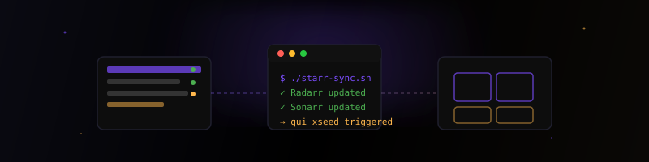
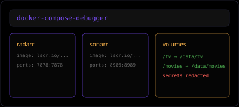

  
  
  <h1>Baker Scripts</h1>
  
Open-source tools and scripts for Plex, Starr apps, and server administration — built for the self-hosted community.

  

    <a class="bs-btn bs-btn--primary" href="https://github.com/baker-scripts">GitHub Organization</a>
    <a class="bs-btn bs-btn--ghost" href="#projects">Browse Projects</a>
    <a class="bs-btn bs-btn--ghost" href="#live-apps">Live Apps</a>
  

<h2 class="bs-section" id="projects">Projects</h2>

  <a class="bs-card" href="projects/StarrScripts/">
    

      
      <h3 class="bs-card__title">StarrScripts</h3>
    

    
Bash scripts for Starr apps — custom formats, naming, and automation for Radarr, Sonarr, Lidarr, and Readarr.

    

      Shell
      View docs →
    

  </a>
  <a class="bs-card" href="projects/Scripts/">
    

      
      <h3 class="bs-card__title">Scripts</h3>
    

    
Personal server administration scripts and shell utilities for day-to-day infrastructure management.

    

      Shell
      View docs →
    

  </a>
  <a class="bs-card" href="projects/autodns/">
    

      
      <h3 class="bs-card__title">autodns</h3>
    

    
Lightweight DNS updater — automatically syncs DNS records from an accessible URL, secured with a unique ID.

    

      Python
      View docs →
    

  </a>
  <a class="bs-card" href="projects/docker-compose-debugger/">
    

      
      <h3 class="bs-card__title">docker-compose-debugger</h3>
    

    
Browser-based Docker Compose debugger — redacts secrets, shows service cards, and generates Markdown tables.

    

      Web
      View docs →
    

  </a>
  <a class="bs-card" href="projects/docs-templates/">
    

      
      <h3 class="bs-card__title">docs-templates</h3>
    

    
MkDocs documentation templates — templatized guides for Plex servers with variable substitution and interactive setup.

    

      MkDocs
      View docs →
    

  </a>
  <a class="bs-card" href="projects/pmm-config/">
    

      
      <h3 class="bs-card__title">pmm-config</h3>
    

    
Kometa configuration — collection templates, overlays, and metadata management for your Plex library.

    

      Kometa
      View docs →
    

  </a>
  <a class="bs-card" href="projects/qui_workflows/">
    

      
      <h3 class="bs-card__title">qui_workflows</h3>
    

    
qui automation workflows for qBittorrent torrent lifecycle management — tagging, limits, and cleanup.

    

      qui
      View docs →
    

  </a>
  <a class="bs-card" href="projects/RedditModLog/">
    

      
      <h3 class="bs-card__title">RedditModLog</h3>
    

    
Automated Reddit moderation log publisher — writes mod actions to a subreddit wiki page on a schedule.

    

      Python
      View docs →
    

  </a>

<h2 class="bs-section" id="live-apps">Live Apps</h2>

  <a class="bs-app-card" href="https://baker-scripts.github.io/docker-compose-debugger/" target="_blank" rel="noopener">
    
    

      <h3 class="bs-app-card__title">Docker Compose Debugger</h3>
      
Paste Docker Compose output and get sanitized YAML, service cards, and Markdown tables for support channels.

      Live app
    

  </a>
  <a class="bs-app-card" href="https://baker-scripts.github.io/docs-templates/plex/" target="_blank" rel="noopener">
    
    

      <h3 class="bs-app-card__title">Plex Guide Template</h3>
      
Live preview of the docs-templates Plex server guide — fork, customize, and deploy your own.

      Live app
    

  </a>

Baker Scripts is a collection of open-source tools maintained by [bakerboy448](https://github.com/bakerboy448), focused on media server automation, Starr app configuration, and infrastructure management.

All projects are available on [GitHub](https://github.com/baker-scripts).

